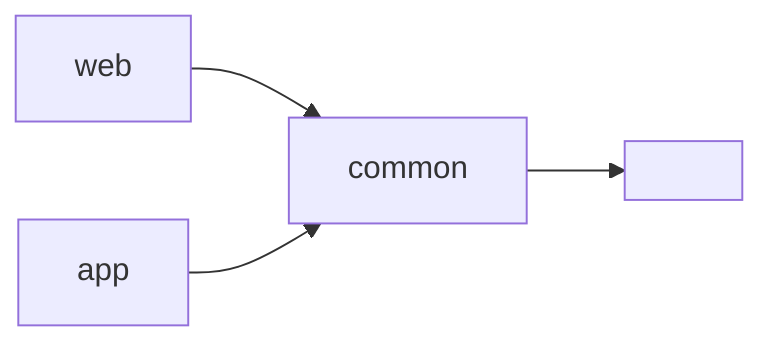
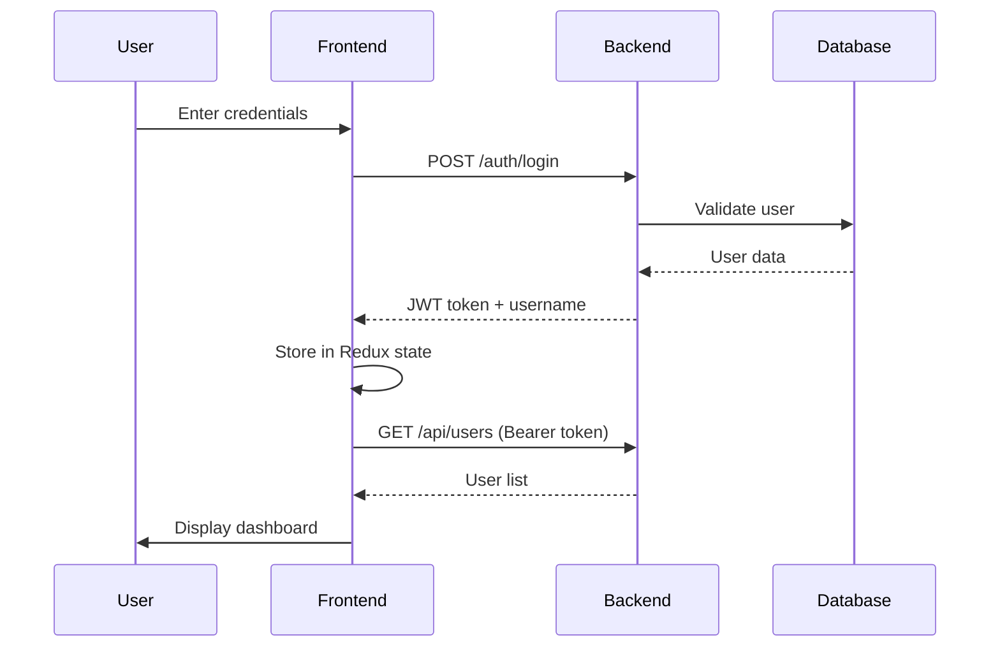

# react-lerna-mono-repo-02

> A production-ready TypeScript monorepo featuring Express backend, React 19 frontend, and shared utilities — built with Lerna, Redux 5, and modern best practices.

[](https://react.dev)
[](https://redux.js.org)
[](https://www.typescriptlang.org)
[](https://lerna.js.org)
[](https://expressjs.com)
[](https://playwright.dev)
[](LICENSE)

---

<!-- markdownlint-disable MD051 -->

## 📖 Table of Contents

- [Overview](#overview)
- [Architecture](#architecture)
- [Quick Start](#quick-start)
- [Packages](#packages)
- [Testing](#testing)
- [Development Commands](#development-commands)
- [Authentication Flow](#authentication-flow)
- [Design System](#design-system)
- [Docker Support](#docker-support)
- [Environment Variables](#environment-variables)
- [Project Status](#project-status)
- [Contributing](#contributing)
- [Troubleshooting](#troubleshooting)
- [License](#license)
<!-- markdownlint-enable MD051 -->

---

<!-- markdownlint-disable MD033 -->

<a id="overview"></a>

<!-- markdownlint-enable MD033 -->

## 🎯 Overview

A full‑stack monorepo demonstrating enterprise‑grade architecture with type‑safe cross‑package imports, comprehensive testing, and polished UI/UX. Built for scalability, maintainability, and developer experience.

### ✨ Key Highlights

- 🔐 **JWT Authentication** with protected API routes
- 🎨 **Modern UI** with responsive design and accessibility
- ⚡ **Performance Optimized** with React.memo and useMemo
- 🧪 **Full Test Coverage** (Jest + Playwright)
- 🔒 **HTTPS Ready** for local development
- 📦 **Type‑Safe Monorepo** with TypeScript project references

---

<!-- markdownlint-disable MD033 -->

<a id="architecture"></a>

<!-- markdownlint-enable MD033 -->

## 🏗️ Architecture

```bash
react-lerna-mono-repo-02/
├── packages/
│   ├── app/           # Backend: Express + MongoDB + JWT
│   ├── web/           # Frontend: React 19 + Redux 5
│   └── common/        # Shared: types, constants, utilities
├── e2e/               # Playwright end‑to‑end tests
├── .husky/            # Git hooks (pre‑commit linting)
├── docker-compose.yml # Container orchestration (MongoDB)
└── playwright.config.ts
```

### Package Dependencies



All packages share TypeScript configuration via project references, ensuring type safety across the monorepo.

---

<!-- markdownlint-disable MD033 -->

<a id="quick-start"></a>

<!-- markdownlint-enable MD033 -->

## 🚀 Quick Start

### Prerequisites

| Requirement | Version | Install                            |
| ----------- | ------- | ---------------------------------- |
| Node.js     | 18+     | [nodejs.org](https://nodejs.org)   |
| npm         | 9+      | Included with Node                 |
| MongoDB     | 6+      | [mongodb.com](https://mongodb.com) |

### Installation

```bash
# Clone repository
git clone https://github.com/yourusername/react-lerna-mono-repo-02.git
cd react-lerna-mono-repo-02

# Install all dependencies
npm install

# (Optional) Generate self‑signed certificates for HTTPS
npm run generate-certs

# Start development servers (HTTP)
npm run dev
```

### Access Points

| Service     | URL                             |
| ----------- | ------------------------------- |
| Frontend    | <https://localhost:3000>        |
| Backend API | <https://localhost:4000>        |
| API Health  | <https://localhost:4000/health> |

> 🔐 HTTPS uses self‑signed certificates. Click "Advanced → Proceed" on first load, or install the certificate locally for a trusted experience.

---

<!-- markdownlint-disable MD033 -->

<a id="packages"></a>

<!-- markdownlint-enable MD033 -->

## 📦 Packages

### `@demo/app` — Backend

| Feature       | Description                             |
| ------------- | --------------------------------------- |
| **Framework** | Express 4 with TypeScript               |
| **Database**  | MongoDB + Mongoose ODM                  |
| **Auth**      | JWT tokens with middleware validation   |
| **Logging**   | Structured logging with timestamps      |
| **Tests**     | Jest unit tests for routes & middleware |

**Key Files**:

```bash
packages/app/src/
├── index.ts           # Server entry + HTTPS toggle
├── app.ts             # Express app + middleware
├── db.ts              # MongoDB connection
├── middleware/auth.ts # JWT validation
└── routes/auth.ts     # /auth/login, /health
```

---

### `@demo/web` — Frontend

| Feature       | Description                           |
| ------------- | ------------------------------------- |
| **Framework** | React 19 with TypeScript              |
| **State**     | Redux 5 with typed hooks              |
| **Build**     | Webpack 5 with HMR                    |
| **UI**        | Responsive card grid + top navigation |
| **Tests**     | Jest + React Testing Library          |

**Key Files**:

```bash
packages/web/src/
├── App.tsx              # Main app + auth gate
├── Header.tsx           # Top navigation bar
├── LoginPage.tsx        # Authentication form
├── components/          # UserCard, UserList, states
├── store/               # Redux actions, reducers, types
└── styles/mainStyles.ts # Style constants
```

**Optimizations**:

- ✅ `React.memo` on `UserCard` prevents unnecessary re‑renders
- ✅ `useMemo` caches expensive `JSON.stringify` operations
- ✅ Style constants reduce inline style overhead
- ✅ Semantic HTML with ARIA labels for accessibility

---

### `@demo/common` — Shared Library

| Export         | Type      | Purpose                     |
| -------------- | --------- | --------------------------- |
| `User`         | Interface | Shared user type definition |
| `APP_NAME`     | string    | Application name constant   |
| `formatUser()` | function  | User display formatter      |

**Purpose**: Type‑safe cross‑package imports via TypeScript project references.

---

<!-- markdownlint-disable MD033 -->

<a id="testing"></a>

<!-- markdownlint-enable MD033 -->

## 🧪 Testing

### Unit Tests (Jest)

```bash
# Run all unit tests
npm test

# Run with watch mode
npm test -- --watch

# Run specific package
npx lerna run test --scope=@demo/web
```

**Coverage**:

- ✅ Redux actions and reducers
- ✅ React components (rendering, interactions)
- ✅ Backend routes and middleware
- ✅ Shared utility functions

### E2E Tests (Playwright)

```bash
# Run all E2E tests
npx playwright test

# Run with visual UI
npx playwright test --ui

# Run specific test
npx playwright test --grep "user can log in"

# View HTML report
npx playwright show-report
```

**Test Scenarios**:

- ✅ Unauthenticated user sees login page
- ✅ User can log in and view main app
- ✅ API health endpoint responds
- ✅ Authenticated UI elements render correctly

### Type Checking

```bash
# Full type validation across all packages
npm run typecheck

# Force rebuild of TypeScript project references
npm run typecheck -- --build --force
```

---

<!-- markdownlint-disable MD033 -->

<a id="development-commands"></a>

<!-- markdownlint-enable MD033 -->

## 🛠️ Development Commands

| Command                  | Description                         |
| ------------------------ | ----------------------------------- |
| `npm run dev`            | Start all packages (HTTP)           |
| `npm run dev:https`      | Start all packages (HTTPS)          |
| `npm run start:app`      | Start backend only                  |
| `npm run start:web`      | Start frontend only                 |
| `npm run build`          | Production build all packages       |
| `npm run rebuild`        | Clean + rebuild all                 |
| `npm run test`           | Run all unit tests                  |
| `npm run typecheck`      | Validate TypeScript types           |
| `npm run generate-certs` | Create self‑signed SSL certificates |
| `npm run clean`          | Remove all build artifacts          |

> **Note**: These scripts assume they are defined in the root `package.json`. Adjust according to your actual setup.

---

<!-- markdownlint-disable MD033 -->

<a id="authentication-flow"></a>

<!-- markdownlint-enable MD033 -->

## 🔐 Authentication Flow



---

<!-- markdownlint-disable MD033 -->

<a id="design-system"></a>

<!-- markdownlint-enable MD033 -->

## 🎨 Design System

### Color Palette

| Token             | Value     | Usage            |
| ----------------- | --------- | ---------------- |
| `--color-primary` | `#2c3e50` | Header, headings |
| `--color-accent`  | `#3498db` | Avatars, links   |
| `--color-danger`  | `#e74c3c` | Logout, errors   |
| `--color-bg`      | `#f5f6fa` | Background       |
| `--color-card`    | `#ffffff` | Cards            |

### Typography

```css
--font-family: "Arial", -apple-system, BlinkMacSystemFont, sans-serif;
--font-size-xs: 12px; /* Subtitles */
--font-size-sm: 14px; /* Body */
--font-size-md: 16px; /* Titles */
--font-size-lg: 20px; /* Headings */
```

---

<!-- markdownlint-disable MD033 -->

<a id="docker-support"></a>

<!-- markdownlint-enable MD033 -->

## 🐳 Docker Support

### Quick Start with Docker

```bash
# Start MongoDB only (default configuration)
docker-compose up -d

# View logs
docker-compose logs -f

# Stop MongoDB
docker-compose down
```

### Services

| Service   | Port  | Description |
| --------- | ----- | ----------- |
| `mongodb` | 27017 | Database    |

> If you wish to containerize the backend and frontend as well, extend the `docker-compose.yml` accordingly.

---

<!-- markdownlint-disable MD033 -->

<a id="environment-variables"></a>

<!-- markdownlint-enable MD033 -->

## 🔧 Environment Variables

Each package may require its own `.env` file. Copy the examples and adjust values:

```bash
# Root (if any)
cp .env.example .env

# Backend
cp packages/app/.env.example packages/app/.env

# Frontend
cp packages/web/.env.example packages/web/.env
```

**Key variables**:

| Variable          | Description                        | Example                     |
| ----------------- | ---------------------------------- | --------------------------- |
| `PORT`            | Backend server port                | `4000`                      |
| `MONGO_URI`       | MongoDB connection string          | `mongodb://localhost:27017` |
| `JWT_SECRET`      | Secret for signing tokens          | `your-secret-key`           |
| `HTTPS_CERT_PATH` | Path to SSL certificate (optional) | `./ssl/server.cert`         |
| `HTTPS_KEY_PATH`  | Path to SSL private key (optional) | `./ssl/server.key`          |

For HTTPS local development, place your certificates in `ssl/` and reference them in the environment.

---

<!-- markdownlint-disable MD033 -->

<a id="project-status"></a>

<!-- markdownlint-enable MD033 -->

## 📊 Project Status

| Feature                       | Status      | Details                            |
| ----------------------------- | ----------- | ---------------------------------- |
| TypeScript Project References | ✅ Complete | Type‑safe cross‑package imports    |
| JWT Authentication            | ✅ Complete | Login, logout, token validation    |
| Redux State Management        | ✅ Complete | Typed actions, reducers, selectors |
| Responsive UI                 | ✅ Complete | Mobile‑friendly card grid          |
| Unit Testing                  | ✅ Complete | Jest + React Testing Library       |
| E2E Testing                   | ✅ Complete | Playwright auth flow tests         |
| HTTPS Development             | ✅ Complete | Self‑signed certificates           |
| Docker Support                | ✅ Complete | `docker-compose.yml` (MongoDB)     |
| Git Hooks                     | ✅ Complete | Husky pre‑commit linting           |
| CI/CD Pipeline                | 🟡 Planned  | GitHub Actions                     |
| Dark Mode                     | 🟡 Planned  | Theme toggle                       |
| Role‑Based Access             | 🟡 Planned  | Admin/user permissions             |

---

<!-- markdownlint-disable MD033 -->

<a id="contributing"></a>

<!-- markdownlint-enable MD033 -->

## 🤝 Contributing

### Getting Started

1. **Fork** the repository
2. **Clone** your fork: `git clone https://github.com/yourusername/react-lerna-mono-repo-02.git`
3. **Create branch**: `git checkout -b feature/your-feature`
4. **Install deps**: `npm install`
5. **Make changes** following existing patterns
6. **Test**: `npm run test && npx playwright test`
7. **Type check**: `npm run typecheck`
8. **Commit**: Husky will run pre‑commit hooks
9. **Push** and create **Pull Request**

### Code Standards

- ✅ Use TypeScript interfaces for all props and state
- ✅ Keep components small and focused (single responsibility)
- ✅ Extract repeated styles to `styles/` constants
- ✅ Write accessible markup (semantic HTML, ARIA)
- ✅ Comment complex logic (hook order, auth flow)
- ✅ Add tests for new functionality

### Commit Messages

Follow [Conventional Commits](https://www.conventionalcommits.org):

```bash
feat: add user profile page
fix: resolve JWT expiration bug
docs: update README with HTTPS instructions
test: add E2E test for logout flow
refactor: extract Header component from App
```

---

<!-- markdownlint-disable MD033 -->

<a id="troubleshooting"></a>

<!-- markdownlint-enable MD033 -->

## 🛠️ Troubleshooting

| Issue                             | Solution                                                  |
| --------------------------------- | --------------------------------------------------------- |
| 🔒 Browser "Not Secure" warning   | Install self‑signed cert or click "Advanced → Proceed"    |
| 📦 Module not found: @demo/common | Run `npm run rebuild` to compile shared package           |
| 🔄 Proxy errors in dev            | Verify `secure: false` in Webpack proxy config            |
| 🧊 Stale build artifacts          | Run `npm run clean && npm run rebuild`                    |
| 🎭 Playwright selector fails      | Use `--ui` mode; prefer `getByRole` over `getByText`      |
| 🔁 Mixed content warnings         | Ensure all API URLs use `https://` when frontend is HTTPS |

### Debug Commands

```bash
# Clear all build artifacts
npm run clean

# Force TypeScript rebuild
npm run typecheck -- --build --force

# View Playwright test trace
npx playwright show-trace test-results/*/trace.zip

# Check bundle analysis
npm run build -- --stats
```

---

<!-- markdownlint-disable MD033 -->

<a id="license"></a>

<!-- markdownlint-enable MD033 -->

## 📄 License

MIT © 2026 Lerna Mono Demo Team

See [LICENSE](LICENSE) for full terms.

---

## 🙏 Acknowledgments

- Built with ❤️ using React 19, Redux 5, Express, and TypeScript
- Inspired by modern monorepo patterns and developer experience best practices
- Tested with Jest and Playwright for confidence at every layer

---

## 📬 Contact

- **Repository**: [github.com/yourusername/react-lerna-mono-repo-02](https://github.com/yourusername/react-lerna-mono-repo-02)
- **Issues**: [GitHub Issues](https://github.com/yourusername/react-lerna-mono-repo-02/issues)
- **Discussions**: [GitHub Discussions](https://github.com/yourusername/react-lerna-mono-repo-02/discussions)

---

> 💡 **Pro Tip**: Star ⭐ this repo if you found it helpful! It helps others discover the project.

**Last Updated**: February 22, 2026
**Version**: 2.1.0
**Status**: ✅ Production‑Ready
