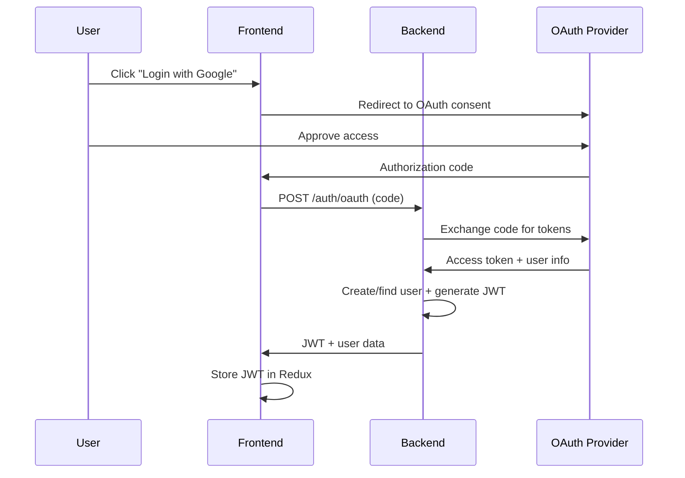

# 🔐 OAuth 2.0 vs JWT: Can You Switch?

**Short Answer**: **Yes!** But they serve different purposes — you can actually use **both together**.

---

## 📊 Key Differences

| Aspect              | JWT (Current)           | OAuth 2.0                                    |
| ------------------- | ----------------------- | -------------------------------------------- |
| **Type**            | Token format            | Authorization framework                      |
| **Auth Method**     | Username/password       | Third-party providers (Google, GitHub, etc.) |
| **Complexity**      | Simple                  | More complex                                 |
| **User Experience** | Manual registration     | Social login (one-click)                     |
| **Security**        | You manage passwords    | Provider manages credentials                 |
| **Best For**        | Internal apps, learning | Public apps, SSO, enterprise                 |

> 💡 **Important**: OAuth 2.0 often **issues JWT tokens** as access tokens — they're not mutually exclusive!

---

## ✅ Option 1: Keep JWT (Recommended for Demo/Learning)

**Your current setup is perfect for**:

- ✅ Learning authentication concepts
- ✅ Full control over user data
- ✅ Simpler implementation
- ✅ No third-party dependencies
- ✅ Faster development

**Keep JWT if**:

- This is a learning/demo project
- You want full control over auth flow
- You don't need social login
- You're the only user

---

## 🚀 Option 2: Add OAuth 2.0 Providers (Enhanced UX)

**Add OAuth 2.0 for**:

- ✅ Social login (Google, GitHub, Microsoft)
- ✅ No password management
- ✅ Better security (providers handle credentials)
- ✅ Single Sign-On (SSO) capability

**Common Providers**:

| Provider      | Use Case        | Setup Complexity |
| ------------- | --------------- | ---------------- |
| **Google**    | General apps    | Medium           |
| **GitHub**    | Developer tools | Easy             |
| **Microsoft** | Enterprise      | Medium           |
| **Auth0**     | All-in-one auth | Easy             |
| **Keycloak**  | Self-hosted SSO | Hard             |

---

## 🔄 Option 3: Hybrid Approach (Best of Both)

**Use OAuth 2.0 for login → Issue JWT for sessions**:



**Benefits**:

- ✅ Social login convenience
- ✅ JWT for API authentication (your existing setup)
- ✅ No major architecture changes
- ✅ Best user experience

---

## 🛠️ Migration Path (If You Want OAuth 2.0)

### Step 1: Install Dependencies

```bash
# Backend (packages/app)
npm install passport passport-google-oauth20 passport-github2 jsonwebtoken

# Frontend (packages/web)
npm install @react-oauth/google  # For Google OAuth
```

### Step 2: Register OAuth Applications

| Provider  | Console URL                                                              | Required Info                |
| --------- | ------------------------------------------------------------------------ | ---------------------------- |
| Google    | [console.cloud.google.com](https://console.cloud.google.com)             | Client ID, Client Secret     |
| GitHub    | [github.com/settings/developers](https://github.com/settings/developers) | Client ID, Client Secret     |
| Microsoft | [portal.azure.com](https://portal.azure.com)                             | Client ID, Tenant ID, Secret |

### Step 3: Update Backend Routes

```ts
// packages/app/src/routes/auth.ts (OAuth example)
import passport from "passport";
import { Strategy as GoogleStrategy } from "passport-google-oauth20";

passport.use(
  new GoogleStrategy(
    {
      clientID: process.env.GOOGLE_CLIENT_ID,
      clientSecret: process.env.GOOGLE_CLIENT_SECRET,
      callbackURL: "/auth/google/callback",
    },
    async (accessToken, refreshToken, profile, done) => {
      // Find or create user in database
      // Generate JWT token
      // Return user + JWT
    },
  ),
);

// OAuth login route
app.get(
  "/auth/google",
  passport.authenticate("google", {
    scope: ["profile", "email"],
  }),
);

// OAuth callback route
app.get(
  "/auth/google/callback",
  passport.authenticate("google", { session: false }),
  (req, res) => {
    // Generate JWT and redirect to frontend
    const token = jwt.sign({ userId: req.user.id }, process.env.JWT_SECRET);
    res.redirect(`http://localhost:3000/auth/callback?token=${token}`);
  },
);
```

### Step 4: Update Frontend Login Page

```tsx
// packages/web/src/LoginPage.tsx
import { GoogleOAuthProvider, GoogleLogin } from "@react-oauth/google";

function LoginPage() {
  const handleSuccess = async (credentialResponse) => {
    // Send Google token to backend
    const response = await fetch("/auth/google/verify", {
      method: "POST",
      body: JSON.stringify({ token: credentialResponse.credential }),
    });
    const { jwt, user } = await response.json();
    // Dispatch LOGIN_SUCCESS with JWT
  };

  return (
    <GoogleOAuthProvider clientId="YOUR_GOOGLE_CLIENT_ID">
      <div>
        <h2>🔐 Sign In</h2>

        {/* Traditional login */}
        <input placeholder="Username" />
        <input placeholder="Password" />
        <button>Sign In</button>

        {/* OAuth login */}
        <p>Or continue with</p>
        <GoogleLogin onSuccess={handleSuccess} />
      </div>
    </GoogleOAuthProvider>
  );
}
```

### Step 5: Update Environment Variables

```bash
# packages/app/.env
GOOGLE_CLIENT_ID=your-google-client-id
GOOGLE_CLIENT_SECRET=your-google-client-secret
GITHUB_CLIENT_ID=your-github-client-id
GITHUB_CLIENT_SECRET=your-github-client-secret
JWT_SECRET=your-jwt-secret  # Still needed for session tokens
```

---

## 📋 Recommendation for Your Project

| Scenario              | Recommendation                   |
| --------------------- | -------------------------------- |
| **Learning/Demo**     | ✅ Keep current JWT setup        |
| **Portfolio Project** | ✅ Add OAuth as bonus feature    |
| **Production App**    | ✅ Use Hybrid (OAuth + JWT)      |
| **Enterprise/SSO**    | ✅ OAuth 2.0 with Auth0/Keycloak |

---

## 🎯 My Suggestion

**For your current monorepo demo**:

1. **Keep the JWT username/password flow** — it's working well and teaches core concepts
2. **Add OAuth as an optional enhancement** — great for showing advanced skills
3. **Document both options** in your README

This gives you:

- ✅ Working auth system now
- ✅ Learning opportunity for OAuth later
- ✅ Impressive portfolio piece with both options

---

## 📖 Updated README Section (If You Add OAuth)

Add this to your `Authentication Flow` section:

```markdown
### Authentication Methods

| Method                | Status      | Description                 |
| --------------------- | ----------- | --------------------------- |
| **Username/Password** | ✅ Complete | Traditional JWT-based auth  |
| **Google OAuth**      | 🟡 Planned  | Social login with Google    |
| **GitHub OAuth**      | 🟡 Planned  | Social login for developers |
| **SSO (SAML)**        | 🟡 Planned  | Enterprise single sign-on   |
```

---

## ❓ Frequently Asked Questions

**Q: Should I replace JWT with OAuth?**  
A: No — OAuth 2.0 typically **issues JWT tokens**. They work together!

**Q: Is OAuth more secure?**  
A: Yes — you don't store passwords, providers handle security.

**Q: Can I support both?**  
A: Yes! Most apps support username/password + OAuth providers.

**Q: Which OAuth provider is easiest?**  
A: **GitHub** for developer tools, **Google** for general apps.

**Q: Do I need a database for OAuth?**  
A: Yes — store user profiles linked to OAuth provider IDs.

---

## 🚀 Want Help Implementing OAuth?

I can help you:

1. 🔧 Add Google OAuth to your existing backend
2. 🔧 Add GitHub OAuth for developer login
3. 🔧 Integrate Auth0 for all-in-one auth
4. 🔧 Update your Redux store for OAuth flow
5. 🔧 Update E2E tests for OAuth scenarios

Just let me know which provider you prefer! 😊

---

**Bottom Line**: Your current JWT setup is **production-ready** for a demo/learning project. OAuth 2.0 is a valuable **enhancement** but not required. You can add it later without rewriting everything! 🎯✨
