# Mobile App Security

For **mobile apps**, the industry standard is **OAuth 2.0 + OIDC (OpenID Connect) with PKCE**, which typically **issues JWTs** as access tokens.

So the answer isn't "JWT vs. OAuth" — it's **"Username/Password Flow vs. OAuth Flow"** (both usually result in JWTs).

---

## 🏆 Winner for Mobile: OAuth 2.0 + PKCE + JWT

| Feature                | Username/Password + JWT      | OAuth 2.0 + PKCE + JWT                                 |
| ---------------------- | ---------------------------- | ------------------------------------------------------ |
| **Security**           | ⚠️ Moderate (password risks) | ✅ **High** (no passwords, PKCE prevents interception) |
| **UX**                 | ⚠️ Manual entry              | ✅ **Excellent** (Social login, biometrics, SSO)       |
| **Token Storage**      | 🔒 Secure Enclave/Keystore   | 🔒 Secure Enclave/Keystore                             |
| **Secrets**            | ❌ None needed               | ❌ None needed (PKCE for public clients)               |
| **Session Management** | ✅ Refresh tokens            | ✅ Refresh tokens + rotation                           |
| **Best For**           | Internal tools, simple apps  | **Public apps, production, scale**                     |

---

## 🔐 Why OAuth 2.0 + PKCE is Critical for Mobile

### 1. **Mobile Apps Are "Public Clients"**

Unlike backend servers, mobile apps **cannot store secrets** (client_secret). Code can be decompiled.

- ❌ **Old OAuth 2.0**: Required `client_secret` (unsafe for mobile)
- ✅ **OAuth 2.0 + PKCE**: No secret needed, uses code verifier/challenge instead

### 2. **Prevents Authorization Code Interception**

PKCE (Proof Key for Code Exchange) prevents malicious apps from intercepting OAuth callbacks.

```mermaid
sequenceDiagram
    participant App
    participant Browser
    participant AuthServer
    participant API

    App->>App: Generate code_verifier
    App->>App: Create code_challenge
    App->>AuthServer: Auth request + code_challenge
    AuthServer->>Browser: Show login
    Browser->>App: Redirect with auth_code
    App->>AuthServer: Exchange code + code_verifier
    AuthServer->>App: ✅ JWT Access Token
    App->>API: Request + JWT
    API->>App: ✅ Data
```



### 3. **Secure Token Storage**

Mobile apps must store tokens in **encrypted system storage**, not plain text:

| Platform         | Storage                                        |
| ---------------- | ---------------------------------------------- |
| **iOS**          | Keychain Services                              |
| **Android**      | EncryptedSharedPreferences / Keystore          |
| **React Native** | `react-native-keychain` or `expo-secure-store` |
| **Flutter**      | `flutter_secure_storage`                       |

### 4. **Biometric Authentication**

OAuth flows integrate seamlessly with FaceID/TouchID:

```tsx
// Example: Unlock stored tokens with biometrics
const credentials = await Keychain.getGenericPassword({
  accessControl: Keychain.ACCESS_CONTROL.BIOMETRY_ANY,
});
```

### 5. **Deep Linking / App Links**

OAuth callbacks redirect back to your app securely:

```xml
<!-- AndroidManifest.xml -->
<intent-filter>
  <action android:name="android.intent.action.VIEW" />
  <category android:name="android.intent.category.DEFAULT" />
  <data android:scheme="com.yourapp" android:host="callback" />
</intent-filter>
```

```swift
// iOS Info.plist
<key>CFBundleURLTypes</key>
<array>
  <dict>
    <key>CFBundleURLSchemes</key>
    <array>
      <string>com.yourapp</string>
    </array>
  </dict>
</array>
```

---

## 🛠️ Recommended Stack for Mobile + Your Backend

Since you already have an Express backend issuing JWTs, you can **reuse it** for mobile:

### Backend Changes (Minimal)

1. **Add PKCE support** to your OAuth routes
2. **Enable CORS** for mobile deep link schemes
3. **Rate limit** auth endpoints
4. **Use refresh token rotation** (invalidate old refresh token on each use)

### Frontend (Mobile) Options

| Framework            | Recommended Libraries                                      |
| -------------------- | ---------------------------------------------------------- |
| **React Native**     | `react-native-app-auth`, `@react-native-community/netinfo` |
| **Flutter**          | `flutter_appauth`, `dio`                                   |
| **iOS (Swift)**      | `AppAuth-iOS`, `URLSession`                                |
| **Android (Kotlin)** | `AppAuth-Android`, `Retrofit`                              |

### Example: React Native + OAuth + JWT

```bash
npm install react-native-app-auth react-native-keychain
```

```tsx
// Auth flow
const result = await authorize({
  clientId: "YOUR_MOBILE_CLIENT_ID",
  redirectUrl: "com.yourapp://callback",
  scopes: ["openid", "profile", "email"],
  serviceConfiguration: {
    authorizationEndpoint: "https://yourapi.com/oauth/authorize",
    tokenEndpoint: "https://yourapi.com/oauth/token",
  },
});

// Store tokens securely
await Keychain.setGenericPassword("access_token", result.accessToken, {
  accessControl: Keychain.ACCESS_CONTROL.BIOMETRY_ANY,
});

// Use JWT for API calls
const response = await fetch("https://yourapi.com/api/users", {
  headers: {
    Authorization: `Bearer ${result.accessToken}`,
  },
});
```

---

## 📋 Security Checklist for Mobile Auth

| Requirement                  | Implementation                                  |
| ---------------------------- | ----------------------------------------------- |
| **PKCE**                     | ✅ Mandatory for all OAuth flows                |
| **Token Storage**            | ✅ Keychain (iOS) / Keystore (Android)          |
| **HTTPS**                    | ✅ All API calls must use TLS 1.2+              |
| **Certificate Pinning**      | ✅ Optional (prevents MITM attacks)             |
| **Biometrics**               | ✅ Require FaceID/TouchID for sensitive actions |
| **Refresh Tokens**           | ✅ Rotate on each use, short expiry             |
| **Access Tokens**            | ✅ Short-lived (15-60 minutes)                  |
| **Jailbreak/Root Detection** | ✅ Optional (block compromised devices)         |

---

## 🎯 Recommendation for Your Monorepo

Since you're building a **demo/learning project** that might expand to mobile:

### ✅ Best Approach: Hybrid (OAuth 2.0 + JWT)

1. **Keep your existing JWT system** for username/password login
2. **Add OAuth 2.0 + PKCE** for social login (Google, GitHub)
3. **Reuse the same backend** for web + mobile
4. **Issue JWTs** for both flows (your frontend already handles JWTs)

### 📁 Updated Backend Structure

```bash
packages/app/src/
├── routes/
│   ├── auth.ts          # Username/password + JWT
│   ├── oauth.ts         # OAuth 2.0 + PKCE + JWT
│   └── token.ts         # Refresh token rotation
├── middleware/
│   └── auth.ts          # JWT validation (works for web + mobile)
```

### 📱 Mobile-Specific README Section

Add this to your README if you plan to support mobile:

```markdown
## 📱 Mobile Support

### Authentication

- ✅ OAuth 2.0 + PKCE for public clients
- ✅ JWT access tokens (short-lived)
- ✅ Refresh tokens with rotation
- ✅ Secure storage (Keychain/Keystore)

### Deep Linking

- iOS: `com.yourapp://callback`
- Android: `com.yourapp://callback`

### Libraries

- React Native: `react-native-app-auth`
- Flutter: `flutter_appauth`
```

---

## 🚀 Quick Decision Guide

| Your Goal                  | Use This                                          |
| -------------------------- | ------------------------------------------------- |
| **Learning auth concepts** | ✅ Keep JWT username/password                     |
| **Portfolio project**      | ✅ Add OAuth + JWT (shows advanced skills)        |
| **Production mobile app**  | ✅ OAuth 2.0 + PKCE + JWT (industry standard)     |
| **Enterprise/SSO**         | ✅ OAuth 2.0 + OIDC + JWT (Auth0, Okta, Keycloak) |
| **Internal tool only**     | ✅ JWT username/password is fine                  |

---

## 💡 Bottom Line

For **mobile apps**:

1. **Use OAuth 2.0 + PKCE** for the login flow (security + UX)
2. **Use JWT** as the access token format (your backend already does this ✅)
3. **Store tokens securely** (Keychain/Keystore, never plain text)
4. **Implement refresh token rotation** (prevent token theft)

Your current backend is **90% ready** for mobile — you just need to add PKCE support to the OAuth routes and ensure your JWT validation middleware works for mobile clients! 🎯

Want help adding PKCE to your Express backend? I can provide the exact code! 😊
